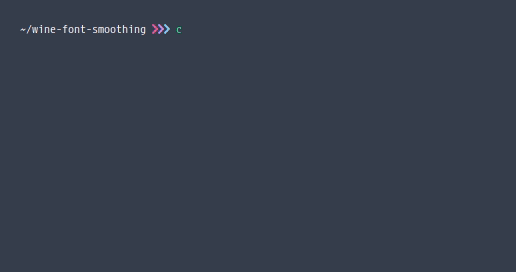
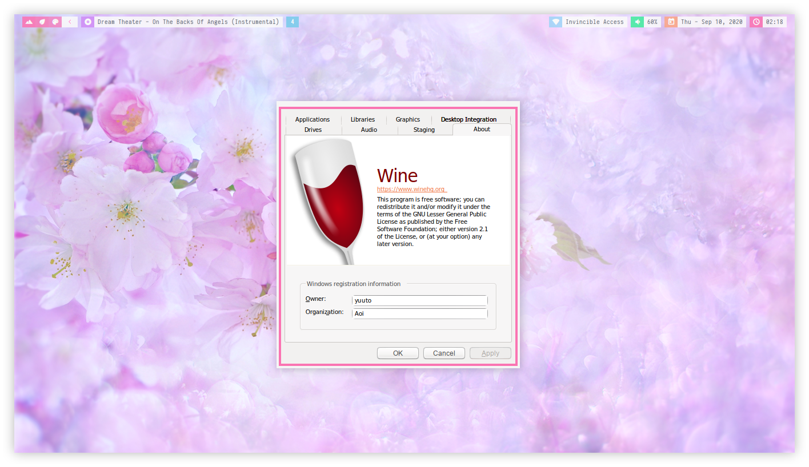

## :wine_glass: Wine Font Smoothing

<a href="./assets/preview.gif"></a>

Clone this repository
```bash
git clone https://github.com/owl4ce/wine-font-smoothing.git
```
or download it as a zip. After that, execute the [wfs](./wfs) program.

> :heavy_check_mark: Successfully tested at **wine-5.16 (Staging)**

---



<a href="https://www.deviantart.com/aerilius/art/Ubuntu-Light-Themes-12-10-327631977"><p align="center">Ubuntu Light Themes 12.10</p><a>
