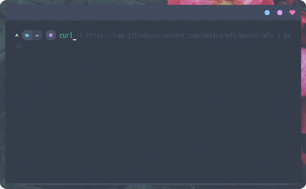
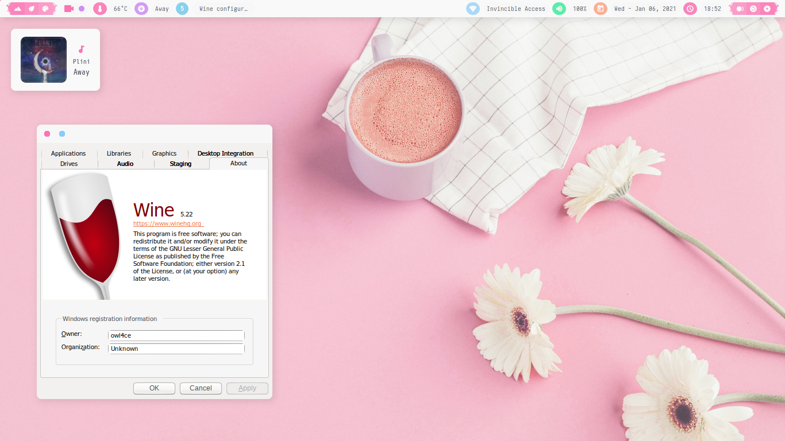

<h2 align="center">Wine Font Smoothing</h2>

<a href="#wine-font-smoothing"></a>

## Dependencies 
`dialog` `libnewt`

## Run
Curl `wfs` script.

```bash
curl -L https://raw.githubusercontent.com/owl4ce/wfs/master/wfs | bash
```

> :heavy_check_mark: Successfully tested on **wine-5.22 (Staging)**

<br>



## <a href="https://www.deviantart.com/aerilius/art/Ubuntu-Light-Themes-12-10-327631977"><p align="center">Ubuntu Light Themes 12.10</p><a>
