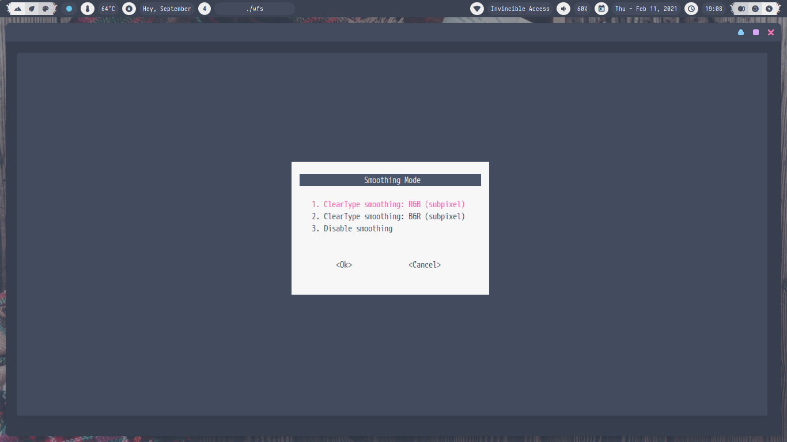
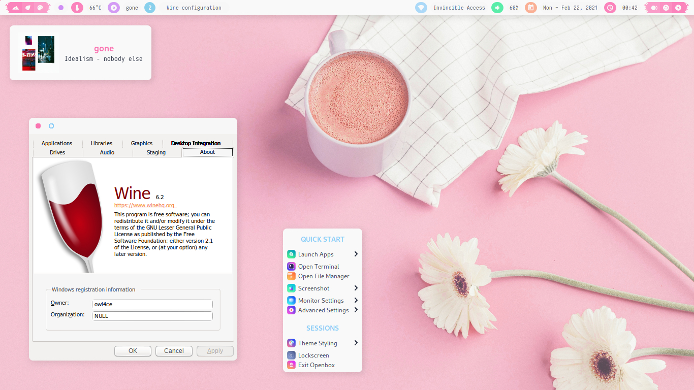

<h2 align="center">Wine Font Smoothing</h2>

### Dependencies 
`dash/bash` `newt/dialog` `wine`

##  
### Run
cURL/wget **wfs** then select your options.

```bash
$ curl -s "https://raw.githubusercontent.com/owl4ce/wfs/main/wfs" | sh
```

> :heavy_check_mark: **wine-6.X (Staging)**

##  

<p align="center"></p>

<p align="center"></p>

##  

### <p align="center"><a href="https://www.deviantart.com/aerilius/art/Ubuntu-Light-Themes-12-10-327631977"><kbd>Ubuntu Light Themes 12.10</kbd></a></p>
